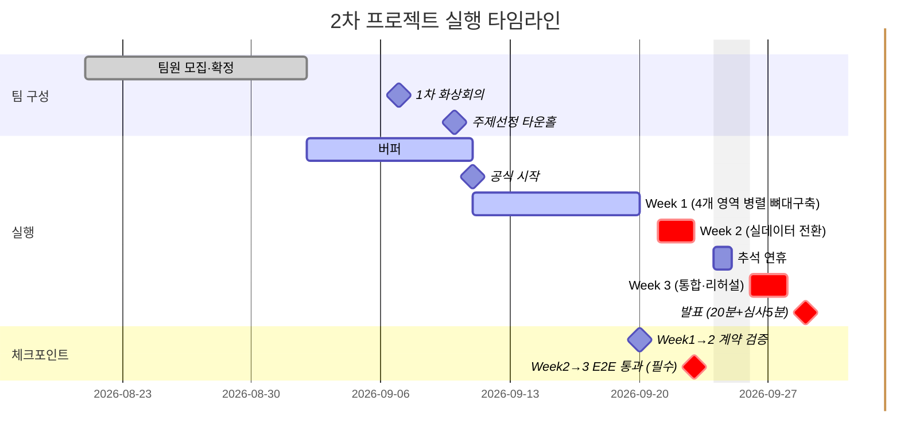

-> 관련 문서: [[12. KickOFF]] · [[24. 기능명세서 v1]] · [[15. 기능 백로그 & 마켓플레이스 로드맵]]
> **상태**: 🌱 초안 — 팀 합류 전 PM이 먼저 그려본 병렬 작업 계획.
> **2026-08-24 실제 일정 반영**: 학교 공식 공지 수신 — 팀 최종 확정 9/2, 주제선정 타운홀 9/10, 프로젝트 공식 시작 9/11, 발표 9/29(타운홀, 팀별 20분+심사5분). 
> **2026-09-05 갱신**: 5개 롤을 4개 영역(데이터·인프라/ML·모델링/RAG·자동화/대시보드·프론트)으로 재정리
> **2026-09-06 갱신**: 9/6 1차 화상회의가 취소되고 새 일정은 아직 미정 — 9/6~9/10을 "조기 착수" 구간으로 보던 계획(회의 직후 바로 개발 착수)은 보류하고, 원래대로 9/2~9/10 전체를 "버퍼(팀 준비 기간)"로 되돌림. 
> **2026-09-07 갱신** : 최민 이나경 임현제 3인 미팅 후 롤 배정, 데이터벌스 환경 초대 완료

## 0. 왜 이 문서가 필요한가
4개 영역(데이터·인프라 / ML·모델링 / RAG·자동화 / 대시보드·프론트) — 3명+PM(RAG 겸임 가능)이 실질적으로 약 2.5주(9/11~9/28, 추석 이틀 제외) 동안 동시에 움직인다. [[24. 기능명세서 v1]] 1절의 크로스커팅 계약(Dataverse 스키마·Security Role·데이터 흐름 순서)만 지키면 서로 안 보고 일해도 맞물리게 설계돼 있지만, "정말 맞물리는지" 확인할 시점을 미리 못박아두지 않으면 마지막 주에 가서야 어긋난 걸 발견하는 사고가 난다. 이 문서는 (1) 실제 날짜에 맞춘 영역별 주차 초안과 (2) 그걸 어떻게 체크할지를 함께 정리한다.

## 0-1. 실제 캘린더 매핑
| 구간         | 날짜                          | 비고                                                                                                                                  |
| ---------- | --------------------------- | ----------------------------------------------------------------------------------------------------------------------------------- |
| 팀 최종 확정    | 9/2(수)                      | 학교 공식 마감                                                                                                                            |
| 버퍼         | 9/2 ~ 9/10                  | 팀원 확정 직후 준비 기간. 1차 화상회의는 9/7 진행 완료 — [[01. 1차 화상회의록]] 참고                                                                            |
| 주제선정 타운홀   | 9/10(목)                     | 학교 공식 행사 [[04.MS-DataSchool/20.PROJECT/22.MS_2nd_Project/01.MS_2nd_Project_Team/00.WBS/05. 회의록/02. 9-10 타운홀 회의록\|02. 9-10 타운홀 회의록]] |
| **Week 1** | 9/11(금, 학교 공식 시작) ~ 9/20(일) | 9/14 9시간 수업                                                                                                                         |
| **Week 2** | 9/21(월) ~ 9/23(수)           | 9/21·22 9시간, 9/23 4시간 수업 — **추석 전 마감**                                                                                              |
| 추석 연휴      | 9/24~25                     | 작업 없음으로 가정                                                                                                                          |
| **Week 3** | 9/26(토) ~ 9/28(월)           | 9/28 9시간 수업이 마지막 준비일                                                                                                                |
| 발표         | 9/29(화)                     | 타운홀, 팀별 20분 발표 + 심사 5분, 시간초과 시 중단                                                                                                   |

**Week 2가 원래 계획보다 짧다(7일→3일).** 추석 연휴가 통합 직전에 끼어 있어서, Week 2 안에 실데이터 전환과 1차 E2E 통과를 못 끝내면 Week 3에 만회할 시간이 사실상 없다. 이 문서의 체크포인트가 특히 Week 2 끝(9/23)에 몰려있는 이유.

### 0-1-1. 버퍼 기간에 끝내둘 것
- ~~1차 화상회의(역할분담·차별점·개발방식 논의) 일정 재조율~~ — 9/7 완료
- 크로스커팅 계약(Dataverse 스키마 7필드) 확정 — 이게 안 끝난 채로 9/11에 들어가면 4개 영역이 전부 각자 다른 가정으로 뼈대를 짜게 된다
- 여유가 되면 Databricks/Dataverse/Power Automate처럼 4개 영역 다 처음 다뤄보는 도구 예습 — Week 2(7일→3일로 압축됨)에 몰리는 부담을 줄이는 데 도움

## 0-2. 팀 구성 (4영역 구조, 9/7 1차 화상회의에서 일부 배정)
실행 폴더 기준 기술 영역은 4개(`40.PIPELINE` / `50.DATABRICKS` / `60.RAG` / `70.FRONT`)인데 사람은 4명(PM 포함)이다. 9/7 화상회의에서 40·50번은 배정됐고, 나머지는 박형준이 합류하는 4인 회의에서 마저 정하기로 함 — [[01. 1차 화상회의록]] 참고.

| 담당자               | 책임 영역                                                                                 |
| ----------------- | ------------------------------------------------------------------------------------- |
| 최민                | 40. Data Pipeline — 데이터 파이프라인(Data Factory) + Azure 인프라(Dataverse·Security Role) + 배포 |
| 임현제               | 50. ML·모델링 — Databricks 노트북 구성, risk_score 구현, held-out 검증                            |
| (미정 — 4인 회의에서 결정) | 70. 대시보드·프론트 — React 2뷰, (Should) Power BI                                            |
| **PM(본인)**        | 크로스커팅 계약 관리, 체크포인트 운영, 블로커 해소, 발표자료                                                   |

> 롤별 상세 작업은 아래 표(1절) 참고 — 여기 간트차트는 전체 일정의 모양만 보여준다.

## 1. 롤별 주차별 초안 (4영역 체제, RAG·자동화 분리)

| 영역       | 담당자     | Week 1 (9/11~9/20, Mock 기준 뼈대)                                                                                             | Week 2 (9/21~9/23, 실데이터 전환)                                                  | Week 3 (9/26~9/28, 통합·검증)                               |
| -------- | ------- | -------------------------------------------------------------------------------------------------------------------------- | ---------------------------------------------------------------------------- | ------------------------------------------------------- |
| 데이터·인프라  | 최민      | Mock 데이터셋 준비 + held-out 생성 스크립트(`generate_v4.py`) 확장 착수, Dataverse `ReorderRecommendation` 테이블 실제 생성 + Security Role 2종 세팅 | nqnq.db 실데이터로 배치 전환(cutoff 8/20), 실제 ML 결과 Dataverse 적재 테스트 + 승인자 권한 실사용자 매핑 | 9월 held-out 정답 데이터 최종 고정·격리, 스키마 동결(freeze) + 예외 케이스 점검 |
| ML·모델링   | 임현제     | 피처 엔지니어링 + Databricks 노트북 구성 착수, mock 데이터로 학습 1회 통과                                                                        | 실데이터 재학습 + 1차 정확도 측정, risk_score 공식 구현                                       | 예측 vs held-out 오차율 계산 스크립트                              |
| RAG·자동화  | (협의 예정) | Power Automate 트리거 뼈대(Dataverse 레코드 생성 → Teams 카드 발송 목업)                                                                   | 실 Dataverse 이벤트 연동, Adaptive Card 문구 실데이터로 교체                                | 승인→상태업데이트 전체 흐름 리허설                                     |
| 대시보드·프론트 | (협의 예정) | React 스캐폴딩, 승인이력·예측대조 2뷰 컴포넌트 뼈대(mock 데이터)                                                                                 | Dataverse API 연동, 실제 승인 클릭 동작 확인                                             | 예측대조 뷰에 오차율 시각화 반영 + 20분 발표 분량 맞추기, E2E 테스팅 및 최종 배포     |
|          |         |                                                                                                                            |                                                                              |                                                         |

## 2. 병렬 작업 체크 방법

### 2-1. 크로스커팅 계약을 "깨면 안 되는 인터페이스"로 취급
[[24. 기능명세서 v1]] 1절이 4개 영역이 서로 안 보고도 맞물리게 해주는 유일한 접점 **이 계약(필드명·타입·흐름 순서)을 바꿔야 할 일이 생기면 그 자리에서 바로 팀 채널에 공지** 

### 2-2. 주 경계 통합 체크포인트 (15~30분)
- **9/20 (Week 1 → 2 경계)**: 각자 만든 뼈대를 Mock 데이터로 한 번 실제로 이어본다(데모 아님, 형식이 계약과 맞는지만 확인). 필드명·타입이 다르면 여기서 잡는다.
- **9/23 (Week 2 → 3 경계, 추석 직전 — 가장 중요한 체크포인트)**: 실데이터로 `예측 → Dataverse → Teams 승인 → 발주확정`까지 **한 번이라도 끝까지** 통과시킨다. 여기서 안 되면 추석 연휴(9/24~25) 동안 손 놓고 있다가 9/28 하루 만에 통합+리허설을 다 해야 하는 최악의 시나리오가 됨.
- **9/28 (발표 하루 전)**: 최종 통합 확인 + 20분 발표 리허설(시간 재보기).

### 2-2-1. 9/23 체크포인트 설계 원칙 (29CM 정산 시스템 마이그레이션 사례 참고, 2026-08-26 추가)
29CM의 [정산 시스템 세대교체](https://techblog.musinsa.com/%EA%B5%AC%EA%B4%80%EC%9D%B4-%EA%BC%AD-%EB%AA%85%EA%B4%80%EC%9D%80-%EC%95%84%EB%8B%88%EB%8B%A4-%EC%A0%95%EC%82%B0-%EC%8B%9C%EC%8A%A4%ED%85%9C%EC%9D%98-%EC%84%B8%EB%8C%80%EA%B5%90%EC%B2%B4-cf714b612638) 사례는 "신규 시스템과 레거시를 함께 돌려 결과를 대조(Dual-Write/Shadow Traffic)"하는 방식으로 무중단 전환을 검증했다. 이 프로젝트의 9월 held-out 대조 검증도 같은 원리 — **모델이 학습 시점(8/20)엔 보지 못한 실측 데이터와 예측치를 대조**하는 것 자체가 축소판 Shadow 검증이다. 9/23 체크포인트에서 최소 아래를 확인:
- 예측 파이프라인이 held-out 구간(8/21~9/20)에서도 **동일한 코드 경로**로 동작하는지(별도 분기 로직 없이)
- 대조 결과(오차율)를 저장하는 형식이 최종 발표용 시각화([[16. PPT plan]])와 맞는지

### 2-3. 비동기 일일 체크인 (Teams, 동기 스탠드업 대신)
학생 프로젝트 특성상 매일 같은 시간에 모이기 어려우므로, 정해진 시각까지 Teams 채널에 텍스트로 "어제 한 일 / 오늘 할 일 / 막힌 것"만 짧게 남긴다. 회의 없이도 누가 지금 뭘 하는지 확인 가능.

### 2-4. Blocked는 다음 체크포인트를 기다리지 않는다
병렬 작업의 가장 큰 리스크는 **한 롤이 막히면 뒤 롤도 순서대로 막히는 것**(데이터 → ML → Dataverse → 자동화 → 대시보드 순서 의존). 막히면 `#blocked` 태그를 달고 즉시 팀 채널에 알리는 걸 규칙으로 — 체크포인트까지 기다리지 않는다.

## 3. 다음 논의 (Week 0)
- [ ] 개발환경/책임영역 배정 — 4인 체제(PM + 최민 + 현제 + 형준)는 확정, 누가 어느 영역(데이터·인프라 / ML / RAG / 대시보드) 맡을지는 협의 필요 — RAG는 PM 겸임 가능성 있음 (2026-09-05) #todo/pre-team
- [ ] 위 롤별 주차 표를 실제 담당자 실력·시간에 맞춰 재조정 #todo/week0
- [ ] MAI 대화형 후속 질의 스트레치 착수 여부 — [[21. Appservice Core model]] 7-1절 참고, 코어 배포 이후에만 #todo/week0
- [ ] 일일 체크인 게시 마감 시각 합의 #todo/week0
- [ ] `#blocked` 알림을 Teams 어느 채널/스레드에 남길지 정하기 #todo/week0

### 3-2. 공식 가이드라인에서 확인된 사항 (2026-09-03 추가, `Microsoft Data School 2차 프로젝트 가이드라인.pptx`, Google Drive)
- **아키텍처 전환**: 2차 프로젝트가 공식적으로 "Azure Databricks 프로젝트"(Data Factory+Databricks 실시간 데이터 처리)로 명명돼 있음을 확인 → ML 기술 핵심을 Databricks로 전환. 상세: [[22. Cost Plan]], [[12. KickOFF]] 4~6절
- [ ] **매일 7시간 이상 팀 미팅 + 녹화 필수**(카메라 ON, 채팅창 활용) — 녹화 파일은 Recording 폴더에 매일 업로드 #todo/week0
- [ ] **출결**: 오전 9시~9시10분 5기 공통팀 출석(호명) + 대한상의 LMS 입실 스크린샷, 오후 5시40분~50분 퇴실 확인 + LMS 퇴실 스크린샷 #todo/week0
- [ ] **데일리 리포트 매일 제출** — 팀원별 활동 내역·진행률(%), 정해진 양식 사용 #todo/week0
- [ ] 가이드라인상 세부 일정(주제설정 9/10~14, 데이터수집 9/15~16, 전처리 9/16~17, 모델링 9/18~21, 상품화 9/21~22, 발표자료 9/23~28)이 아래 Week 1/2/3 구분과 약간 다름 — 팀 논의로 하나로 맞추기 #todo/week0
- [ ] 심사 배점(학습내용 적용정도 20·인공지능 윤리 15·시장가능성 15 등) 확인 — AI 윤리 체크는 [[25. AI 책임원칙 체크리스트]]로 이미 대응 중 #todo/week0

### 3-1. Dataverse 권한 이슈 대응 (2026-08-29 추가, 2026-09-01 해결)
Power Apps에서 Dataverse 테이블 생성은 되지만 권한 문제 발견 — Week 0 데드라인(9/10) 안에 결론 안 나면 SharePoint 폴백([[22. Cost Plan]] 기존 원칙)이 발동돼야 하므로 순서를 정해서 빠르게 처리:
- [x] ① 테크리드 후보에게 먼저 기술적 타당성 확인 — Dataverse 실무 경험 여부, 2.5주 안에 처음 보는 도구+크로스커팅 스키마+Security Role까지 구현 가능하다고 보는지 솔직한 판단 #todo/pre-team
- [x] ② 매니저 논의 대신 자체 해결 — 원인이 권한 정책이 아니라 **공유 기본(Default) 환경에서 시도한 것**이었음. Power Apps가 제안한 "무료 개인 Developer 환경" 생성으로 전환 → 생성자가 자동으로 System Administrator가 되어 매니저 에스컬레이션 불필요 #todo/pre-team
- [x] ③ **Dataverse 사용 확정(Go), SharePoint 폴백 불필요** — 2026-09-01 개인 Developer 환경에서 테이블 생성 성공, 팀원 3명 초대 완료. 다음 단계: 팀원 로그인 확인 → `ReorderRecommendation` 테이블 생성 → Security Role 2종(Reorder Approver/Viewer) 생성 #todo/week0
