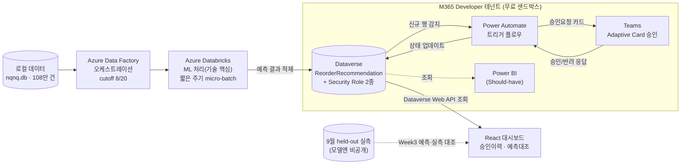
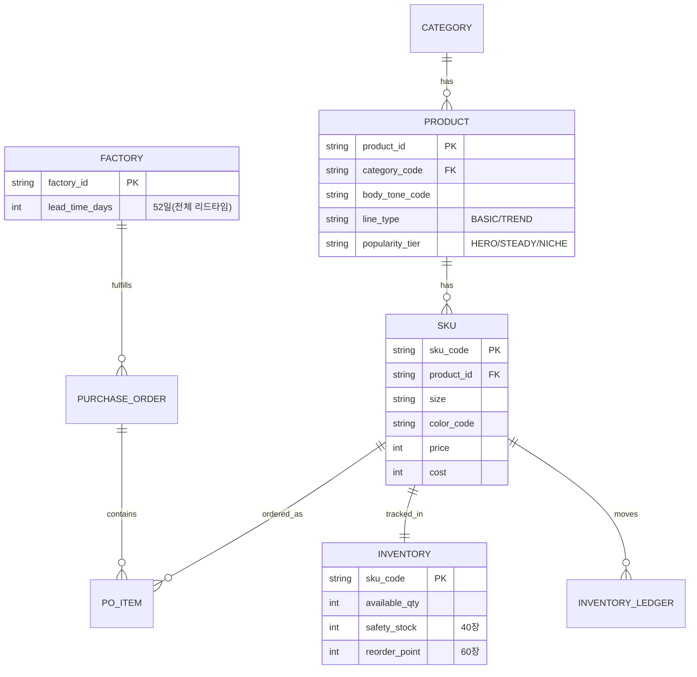

> 관련 문서: [[12. KickOFF]] · [[21. Appservice Core model]] · [[22. Cost Plan]] · [[23. Alert & Trigger Rules]] · [[24. 기능명세서 v1]] · [[03. WBS 상세 (기술 레이어별 일정표)]] · [[71. Entity Definitions & Data Dictionary]]
> **작성일**: 2026-09-06
> **용도**: [[03. WBS 상세 (기술 레이어별 일정표)]] 1단계(자료조사)의 정식 산출물이자, 시장·경쟁사 조사·기술 스택 조사·확정 기술명세·참고자료 인덱스를 하나로 묶은 통합 문서. "왜 이 기술을 조사했고, 무엇을 확인했고, 그래서 우리 설계에 어떻게 반영됐는지"를 순서대로 엮는 역할.

## 0. 조사 개요

### 0-1. 조사 목적
[[03. WBS 상세 (기술 레이어별 일정표)]] 1단계(자료조사)가 요구하는 4가지를 충족하기 위한 조사:
1. **D365/Dataverse·Power Platform 기술 조사** — 우리가 만드는 PoC가 실제 엔터프라이즈 생태계에서 어떤 위치에 놓이는지 확인
2. **경쟁사(HauteLogic/K3/Prodware) 사례 분석** — "패션 버티컬 D365 addon"이라는 카테고리가 실존하는지, 우리 차별점이 무엇인지 검증
3. **1차 프로젝트 코드베이스 분석** — 재사용 가능한 자산 확인 ([[14. 1차 프로젝트 대비 차별화 아이디어]] 참고)
4. **학교 커리큘럼 대비 학습공백 확인** — 실제 구현 가능성 검증

### 0-2. 조사 방법 및 한계
- 대부분 **공개 마케팅 자료·제품 소개 페이지·공식 문서(Microsoft Learn)** 기반 웹 리서치(2026-08-20~09-05)
- 경쟁사의 비공개 기술 문서(API 스펙, DB 스키마)는 확인 불가 — 마케팅 자료 수준의 정보이므로 "방향성 검증" 목적으로만 사용
- 시장 규모 수치는 출처 간 20~40%p 편차가 있어 발표 시 특정 숫자보다 "고성장 카테고리(CAGR 20%+)"라는 방향성만 인용 권장

### 0-3. 결론 요약 (TL;DR)
| 질문 | 답 |
| --- | --- |
| "패션 버티컬 AI + D365" 카테고리가 실존하는가? | ✅ 존재함 (HauteLogic, K3, Prodware가 이미 AppSource에 등재) → build-vs-buy 근거 확보 |
| 우리가 그들과 다른 점은? | 아키텍처상 **"D365 F&O 라이선스 자체가 불필요한 독립 포인트 솔루션"**, 예측 모델상 **체형·날씨 실측 데이터로 조건화한 진짜 ML**(경쟁사는 정적 규칙 또는 클래식 재고이론) |
| 우리 기술 스택이 실제로 구현 가능한가? | ✅ 검증됨 — Data Factory+Databricks(공식 커리큘럼 확정 스코프) + Dataverse/Power Automate/Teams(M365 Developer Program 무료 테넌트) 조합으로 비용 0원 구현 경로 확보 |
| 학습공백은? | Dataverse 자체, Teams Adaptive Card 상세, Databricks — 스파이크테스트·추가학습으로 대응 중 |

---

## 1. 경쟁사 기술 조사 — "패션 버티컬 D365 Addon" 카테고리 분석

> 상세 원자료: [[Brand_k3_fashion]] · [[Brand_hautelogic]]

### 1-1. 조사 대상 및 공통점
D365 AppSource에 실제로 등재된 패션 버티컬 ISV 3종을 조사했다. 셋 다 **Microsoft Dynamics 365 Finance & Operations / Supply Chain Management / Commerce** 위에서 동작하며, "패션 업계는 범용 ERP만으로는 부족하다"는 시장 가설이 이미 검증된 카테고리임을 확인했다.

| 제품 | 개발사 | D365 통합 방식 | 타깃 규모 |
| --- | --- | --- | --- |
| **HauteLogic**(AppSource명 FashionCloud365) | Visionet Systems (2018 출시) | D365 위에 **100+ 사전구성 프로세스 템플릿**을 얹은 산업 액셀러레이터(느슨한 결합) | 직원 251~1,000명 중견기업 |
| **K3 Fashion** | K3 Business Technology Group (現 Infosys 산하, 2023 인수) | D365 **애플리케이션 코드에 완전 임베디드**(같은 DB·보안·화면 프레임워크 공유) | 직원 1,000명 이상 대형 브랜드 |
| **Prodware** | Prodware Group | D365 **Business Central**에 완전 통합된 수요예측(Demand Forecasting) 분석 솔루션 | 중소~중견 규모(BC 타깃) |

### 1-2. 기술 아키텍처 상세 비교

**K3 Fashion — 임베디드형**
- K3 확장 모듈이 D365 F&O 애플리케이션 코드 안에 직접 들어가 같은 데이터베이스·보안/권한 체계·화면 프레임워크를 공유
- 회계 등 범용 기능은 D365 표준을 그대로 쓰고, **패션 특화 기능만 추가 개발**하는 구조 → Microsoft가 공식 "패션 전문 글로벌 ISV"로 파트너 취급
- 핵심 기능: Product Wizard(단계별 상품등록), **Matrix**(컬러×사이즈 그리드 UI), **Ratio Curves**(사이즈별 배분 비율 자동계산 — 정적 템플릿), Season Management, PLM/PDM
- Teams·Office 365·Power BI·Dataverse·Copilot과 자연스럽게 연동(임베디드 구조 덕분)

**HauteLogic — 액셀러레이터형**
- D365 F&O/SCM 위에 "업계 모범사례 기반 사전구성 프로세스 100개+"를 템플릿으로 얹어 구현기간·복잡도 단축
- 핵심 기능: AI 음성 주문 에이전트(내부 엔진 미공개), **머신러닝 기반 수요예측**(마케팅 표현), 개인화 상품 추천, 재고관리/최적화
- **검증 포인트**: "ML 기반 수요예측"의 실제 동작 방식을 조사한 결과, D365 SCM 표준 기능인 **"시차별 재고 가용성(Time-Phased Inventory Availability)"** — 재주문점 계획(reorder point planning)·안전재고 계획·마스터플래닝 알고리즘 — 위에 Visionet의 규칙을 얹은 구조로 확인됨. 즉 **별도 학습 모델이 아니라 클래식 재고관리 알고리즘이 핵심**.

**Prodware — BC 통합형**
- Dynamics 365 Business Central에 완전 통합된 수요예측 분석 솔루션 — 중견기업 대상 D365 티어 중 상대적으로 저렴한 BC를 타깃으로 하는 점에서 규모감상 우리와 가장 가까운 비교군

### 1-3. 핵심 차별화 지점 — "재고 리플레니시먼트"가 왜 패션 특화 문제인가

| 요소 | K3 Fashion | HauteLogic | 우리(Fashion AI Agent Appservice) |
| --- | --- | --- | --- |
| 사이즈별 발주 배분 | **Ratio Curves** — 과거 판매비율을 고정 템플릿으로 저장해 기계적으로 반복 적용하는 정적 규칙 | 명시적 언급 없음(SKU 단위 재주문점) | 사이즈코리아 실측 **인구 체형분포**로 조건화한 예측값(§4-2) — 동적 |
| 날씨 반영 | 문서화 없음 | 문서화 없음 | 니트류 15~20℃ 정점 등 **비선형 기상 조건화**(학술 근거 포함, §4-2) |
| 예측 엔진 | 명시적 언급 없음 | "ML 기반"이나 실제로는 D365 표준 **재주문점/안전재고 계획**(고전 OR 이론) | Databricks 기반 실제 학습 모델(피처: 체형·날씨·프로모션) |
| 인기도 가중치 | 없음 | 없음 | HERO/STEADY/NICHE 티어 가중치로 롱테일 구조 명시적 반영(§5-2) |
| D365 라이선스 요건 | D365 F&O/SCM/Commerce **필요** | D365 F&O/SCM **필요** | **불필요** — SAP 등 기존 ERP를 건드리지 않는 독립 포인트 솔루션(Dataverse 단일) |

**결론**: "패션 ERP" 카테고리는 이미 존재하지만, 그 안의 "재고 배분·예측" 기능 대부분은 **정적 규칙(Ratio Curves) 또는 범용 재고이론(재주문점) 위에 "패션"이라는 라벨만 붙인 것**이다. 우리는 실제 인구통계·기상 데이터로 조건화한 예측 모델을 쓴다는 점, 그리고 D365 자체를 살 필요가 없는 독립 아키텍처라는 점이 이보다 한 단계 더 들어간 기술적 차별점이다.

### 1-4. 검증 사례 — 고객사례·리뷰
- **HauteLogic(G2)**: 평점 4.1 / 리뷰 23개(표본 부족 명시) — 장점: D365 통합 신뢰감, 100+ 사전구성 프로세스, 아웃오브박스 이커머스 연동
- **K3 고객사례**: ASOS(기획~생산 "3주"로 단축, Copilot/MS AI 활용), SanMar(연매출 20억 달러 도매사), NILE(UN SDGs 연계) — **ASOS 사례가 build-vs-buy 논거로 가장 강력**: "대형 브랜드도 이미 D365+AI로 기획-생산 사이클을 단축 중"이라는 실증

### 1-5. 시장 규모 (참고용, 출처 편차 큼)
| 세그먼트 | 2025 | 2026 | 장기 |
| --- | --- | --- | --- |
| AI in Fashion 전체 | ~$1.8B (출처별 $1.75~3.1B) | ~$2.5~4B (CAGR 19~41%) | 2034년 $31.8~40.8B |
| AI 기반 리테일 수요예측·머천다이징 | $3.72B | $4.69B | 2031년 $16.41B (CAGR 28.47%) |

---

## 2. 플랫폼 기술 조사 — Microsoft Dynamics 365 / Dataverse / Power Platform 생태계

### 2-1. 실제 기업의 D365 사용 구조 (배경 지식)
D365는 단일 앱이 아니라 여러 라이선스 앱(Sales/Finance/**SCM**/Commerce 등)의 모음이며, 전부 **Dataverse**라는 공통 데이터 플랫폼 위에서 동작한다. 우리가 만드는 건 "이미 D365 SCM을 쓰는 회사"에 **애드온으로 설치**되는 구조를 시뮬레이션한다:
- 관리자가 AppSource에서 앱을 찾아 자기 회사 Dataverse 환경에 **Solution(테이블+화면+플로우 묶음)**을 import
- 설치되면 기존 D365 화면에 메뉴 하나가 추가되는 느낌으로 동작
- **Security Role**로 "누가 보고 누가 승인 버튼을 누를 수 있는지" 세밀 제어

**우리 프로젝트 적용**: 실제 유료 D365 SCM 라이선스가 없으므로, **Power Apps 개발자 환경(Dataverse 포함, 무료)**에 D365 SCM 발주 테이블 구조를 흉내낸 자체 테이블(`ReorderRecommendation`, §5)을 만들어 "설치되는 애드온" 경험을 시뮬레이션한다.

### 2-2. D365/AppSource 실제 연동 기술 옵션 3가지 (조사 결과)
| 옵션 | 설명 | 이번 스코프 채택 여부 |
| --- | --- | --- |
| **Dataverse Virtual Table** | 외부 시스템 데이터를 복제하지 않고 D365 안에 네이티브 테이블처럼 노출하는 Microsoft 공식 패턴 | 미채택 — 향후 실제 고객사 재고시스템 연동 시 참고할 확장 경로로 백로그 |
| **Power Platform Custom Connector** | 백엔드 API에 OpenAPI 스펙만 붙이면 Power Automate에서 자동발주 승인 플로우 생성 가능 | **이번 프로젝트 기간 안에 실제 구현 가능한 수준으로 확인** |
| **Copilot Studio 기반 Teams 봇** | RAG 코파일럿을 Copilot Studio 토픽으로 구현 시 AppSource "Copilot" 카테고리 등재 후보 | 미채택(Tier 2 백로그, [[15. 기능 백로그 & 마켓플레이스 로드맵]]) — 원래 계획한 Teams Adaptive Card 승인 플로우로도 핵심 흐름 구현 가능해 우선순위 낮춤 |

**AppSource 등재까지의 경로(참고)**: PoC(지금) → Dataverse 연동·Custom Connector 정식화 → Partner Center 등록 → 기술 인증 → AppSource 등재. 실제로 걸어갈 수 있는 검증된 확장 경로가 있다는 것을 확인.

### 2-3. 마켓플레이스 수익모델 조사 (참고용, 이번 피치 핵심 논거 아님)
Microsoft 공식 문서 기준:
- AppSource/Azure Marketplace의 transactable 앱에는 **3% 마켓플레이스 수수료** 적용
- 가격 모델은 ISV 자유 설정(무료/퍼유저/flat-rate/사용량기반) 가능하나, **AppSource(Dynamics 365 apps 카테고리)는 주로 퍼유저·flat-rate로 제한**되고, 사용량기반(consumption)은 Azure Marketplace에서만 가능
- 추천 모델: 1차는 **테넌트당 flat-rate 월 구독**(SKU/거래량이 가치지표에 가까운 재고관리 특성상), 확장 시 Azure Marketplace 사용량 과금 검토

### 2-4. 학교 공식 커리큘럼과의 정합성 확인
공식 학교 공지("2차 프로젝트 팀 발표" PDF, 2026-08-31 확인) 상 "프로젝트 범위"엔 Azure Data 관리·Python&SQL·Power BI·Azure Stream Analytics·**Azure Databricks·Azure Data Factory**·Azure AI Foundry 7개만 명시되어 있고 Dataverse·Power Apps·Power Automate·Teams는 빠져 있어 범위 이탈 우려가 있었으나, **매니저/조교 확인 결과 "다른 것 써도 된다"는 답변 확보(2026-08-31)** — 7개 목록은 배타적 제한이 아니라 예시 수준으로 확인되어 현재 아키텍처(Dataverse/Power Automate/Teams) 유지 결정.

---

## 3. 핵심 기술 스택 조사 및 확정 아키텍처

### 3-1. 아키텍처 전환 히스토리 (조사 → 의사결정 흐름)
| 시점 | 상태 | 근거 |
| --- | --- | --- |
| 초기안 | 로컬 pandas/scikit-learn 학습이 기본, Databricks는 스트레치 | 학생 크레딧 비용 리스크 우려 |
| 2026-09-03 | **Databricks를 ML 기술 핵심으로 승격** | 공식 커리큘럼 가이드라인(`Microsoft Data School 2차 프로젝트 가이드라인.pptx`) 확인 결과, 2차 프로젝트가 공식적으로 **"Azure Databricks 프로젝트"**로 명명되어 있고 목표가 "Data Factory와 Databricks를 활용한 실시간 데이터 처리 모델 개발"임을 확인 |

### 3-2. 확정 기술 스택 및 역할

| 레이어 | 기술 | 역할 | 비용 안전장치 |
| --- | --- | --- | --- |
| 오케스트레이션 | **Azure Data Factory** | Databricks 노트북을 트리거하는 노코드 드래그앤드롭 파이프라인. cutoff(8/20) 학습셋 배치 추출 | 낮은 리스크(학생 크레딧 내 안전) |
| ML/데이터처리(기술 핵심) | **Azure Databricks + PySpark** | 체형·컬러별 판매데이터·날씨·프로모션 학습 → SKU별 수요예측, risk_score 산출 | 소형 클러스터(최소 노드) + **15~30분 유휴 시 자동종료 필수**, 노트북 개발은 로컬 pandas로 먼저 검증 후 클러스터에서 최종 실행 |
| 준실시간 처리 | Databricks **짧은 주기 micro-batch**(5~10분 간격) | 진짜 상시 스트리밍(Event Hub) 없이 "준실시간" 구현 | Event Hub 상시 스트리밍은 시간당 과금 리스크로 지양, 데모 시연 시에만 짧게 시연 |
| 서빙/액션 레이어 | **Dataverse**(Power Platform) | Databricks 처리 결과 적재 → Teams 승인 액션으로 연결하는 차별화 레이어. 별도 Cosmos DB 서빙 레이어는 불필요 판단 | M365 Developer Program 무료 샌드박스 테넌트 |
| 자동화 | **Power Automate** | Dataverse 신규 행 감지 → Teams Adaptive Card 발송 → 승인 시 상태 업데이트 | 무료 테넌트 포함 |
| 승인 UX | **Teams Adaptive Card** | 로그인 없이 클릭 한 번으로 승인/반려, 별도 D365 F&O 라이선스 불필요 | 무료 테넌트 포함 |
| 대시보드 | **React** (2뷰: 승인이력, 예측대조) | Dataverse Web API 조회 | — |
| (Should-have) | Power BI | Dataverse 조회 리포트 | 무료 테넌트 포함 |

**예산**: 팀당 60만원(2026-08-24 학교 공지, 1차 대비 여유). 상시 유료 컴퓨팅(클러스터 방치, 상시 엔드포인트)은 예산 여유와 무관하게 지양하는 원칙 유지 — 여유 예산은 스트레치 시도·초과사용료 예비용으로만 보유.

### 3-3. 시스템 아키텍처 다이어그램 (확정본)
실선이 핵심 데모 경로, 점선은 Should-have(Power BI)·검증용(held-out 대조) 보조 경로.

### 3-4. 데이터 흐름 순서 (크로스커팅 계약)
`Data Factory(오케스트레이션)` → `Databricks ML 처리(결과를 직접 Dataverse에 적재)` → `Dataverse ReorderRecommendation 레코드 생성` → `Power Automate 트리거` → `Teams Adaptive Card` → `승인 시 Dataverse 상태 업데이트` → `React 대시보드가 Dataverse 조회` (별도 서빙 레이어 없이 Dataverse 단일 저장소 구조)

### 3-5. 비용 소진 모니터링 — Burn Rate 2단계 알림
무신사 O4O팀의 SLO/Error Budget 운영 사례를 벤치마킹해 Databricks가 기술 핵심으로 격상된 뒤 신설:

| 단계 | 조건 | 대응 |
| --- | --- | --- |
| 주의(Warning) | 남은 크레딧 7일 이내 소진 예측 | PM 알림, 클러스터/엔드포인트 방치 점검 |
| 긴급(Critical) | 2일 이내 소진 예측, 또는 Databricks 클러스터 24시간 이상 미종료 감지 | 즉시 종료, 스트레치 항목 우선순위 하향 |

작업 세션마다(최소 일 1회) 잔액 스냅샷 기록, 클러스터 작업 종료 시 "종료됨" 상태 직접 확인을 팀 규칙으로 확정.

---

## 4. 데이터 아키텍처 기술 조사

### 4-1. DBMS 선정 및 마이그레이션 경로
| 단계 | DBMS | 선정 이유 |
| --- | --- | --- |
| 로컬 개발/MVP | **SQLite**(`nqnq.db`) | 무료, 서버리스, 14개 테이블·초기 수만 row 규모에 충분 |
| 성장 단계 | **PostgreSQL**(관리형: Supabase, Neon) | SQL 표준 호환성 높아 마이그레이션 비용 최소화, 무료 티어 제공 |
| 스케일업 | PostgreSQL(AWS RDS 등) | 인스턴스 스펙 조정, 리전 복제 |

**마이그레이션 친화적 설계 원칙**: 표준 SQL 타입 명시, ORM+마이그레이션 도구(SQLAlchemy+Alembic 등), FK 제약 명시적 선언(`PRAGMA foreign_keys = ON`), **문자열 기반 PK**(`sku_code`, `order_id` 등 — 오토인크리먼트 정수 PK는 DB 간 구현 차이로 마이그레이션 충돌 여지), ISO 8601 날짜 포맷 통일.

**무중단 전환 검증 전략**: 29CM 정산 시스템 세대교체 사례의 **Dual-Write/Shadow Traffic** 패턴을 참고 — 신규·기존 시스템 병행 운영 후 핵심 집계값(SKU별 재고, 일별 매출) 배치 대조, 100% 일치 확인 후 컷오버. 이 "대조 검증" 철학은 9월 held-out 검증(§6)과 구조적으로 동일한 패턴.

### 4-2. 실데이터 그라운딩 — 가상데이터를 실측 통계로 조건화
가상데이터의 설득력을 높이기 위해 프로모션 배수·카테고리 가격 등 설계자 가정값 대신, **날씨·체형 2가지를 실제 공개 데이터로 조건화**했다.

**날씨**: 기상청 기후평년값(1991~2020, data.kma.go.kr) 서울 월평균기온 → 월 15일 기준 인접월 선형보간으로 일 단위 근사기온 산출(`get_temp()`). 카테고리별 기온 민감도(설계값, 기준기온은 실측):

| 카테고리 | 민감도 방향 | 계산식 |
| --- | --- | --- |
| OUT(아우터) | 추울수록 수요↑ | `1 + max(0,(18-기온)/18) × 1.5` |
| DRS(원피스) | 따뜻할수록 수요↑ | `1 + max(0,(기온-15)/15) × 1.2` |
| TOP | 완만하게 따뜻할수록↑ | `1 + max(0,(기온-10)/25) × 0.4` |
| PNT | 완만하게 추울수록↑ | `1 + max(0,(15-기온)/25) × 0.5` |

검증 결과: OUT 카테고리 판매 비중이 여름 23~35% → 겨울 53~55%로 뚜렷한 계절성 확인(nqnq.db 실측).

**체형**: 2018 디지틀조선일보 2030 여성 신장분포 설문 + 사이즈코리아 7차 조사(2015, 20대 여성 평균키 160.9cm)와 정합하는 신장 구간별 비율(155cm 미만 7%~170cm 이상 4%)을 사이즈 매핑에 반영. 검증 결과: 생성된 PANTS 주문의 실제 사이즈 분포가 목표 실측치와 거의 정확히 일치(S 28.4%/M 36.8%/L 23.5%/XL 4.1%/XS 7.2%).

**퍼스널컬러는 의도적으로 ML 대상에서 제외**: 국가 통계·과학적 측정 데이터가 존재하지 않는 뷰티 업계 경험적 분류이므로, 균등가정(각 1/3) + 룰 기반 매핑을 정직한 방법으로 채택.

### 4-3. 핵심 엔터티 데이터 딕셔너리 (요약)
전체 14개 엔터티 중 예측·승인 흐름과 직결되는 핵심만 발췌(전체는 [[71. Entity Definitions & Data Dictionary]] 참고):

네이밍 컨벤션은 토스플레이스 PANDA 사례의 "테이블/컬럼명만 보고 역할을 알 수 있게" SSOT 원칙을 참고해 명문화(테이블=대문자 단수 명사, PK=`{entity}_id`/도메인코드, 이력 테이블=`{원본}_LEDGER`).

---

## 5. 크로스커팅 기술 계약 (확정 스펙)

### 5-1. Dataverse 테이블: `ReorderRecommendation`
| 필드 | 타입 | 설명 |
| --- | --- | --- |
| sku_code | Text (PK) | 대상 SKU |
| predicted_demand | Number | 예측 수요량 |
| recommended_qty | Number | 추천 발주량 |
| risk_score | Number | 품절위험 스코어(§5-2 공식) |
| status | Choice | Pending / Approved / Rejected |
| created_at | DateTime | 생성 시각 |
| approved_by | Lookup(User) | 승인자(감사추적용) |

레코드 생성 트리거 조건: **SKU 재고가 리오더포인트(60장) 도달** — 리드타임 52일 고려한 재발주 필요 알림.

### 5-2. risk_score 산출 공식
토스플레이스 PANDA의 "유사도 점수 × 계층 가중치" 스코어링 구조를 참고해 확정(2026-08-26).

**risk_score = 재고소진임박도 × 인기도가중치**

| 요소 | 계산 | 근거 |
| --- | --- | --- |
| 재고소진임박도 | `max(0, 1 - (available_qty / (일평균판매속도 × lead_time_days)))` | 리드타임 동안 버틸 재고가 없을수록 1에 수렴 |
| 인기도가중치 | HERO 1.5 / STEADY 1.0 / NICHE 0.7 | HERO 품절은 매출 임팩트가 더 크므로 가중 |

이 공식은 오퍼레이션스 리서치의 고전 분야인 **안전재고/재주문점 이론**을 데이터에 맞게 단순화한 것 — 검증된 재고이론 위에 있다는 학술 근거(Reorder Point 최적화 케이스스터디, IEEE 안전재고 시스템 논문, Monte-Carlo 재고관리 시뮬레이션)를 확보했다.

### 5-3. Security Role
- `Reorder Approver` — 승인/반려 가능
- `Viewer` — 읽기 전용

### 5-4. 확정 제외 사항 (Out of Scope)
GenAI 콘텐츠 생성(카피라이팅·룩북 이미지), 부서별 다중 KPI 대시보드, 실제 AppSource 등재, 실제 Event Hub 상시 스트리밍, Cosmos DB 서빙 레이어, 실시간 A/B테스트 인프라.

---

## 6. AI/ML 기술 설계 조사 — 예측근거 자연어 설명 (Tier 1 스트레치)

### 6-1. 벤치마킹 사례
무신사 [MATCH Console & MAI](https://techblog.musinsa.com/match-console-mai-e65b2cfd687e)의 **ReAct(탐색→생성→검증) 패턴**과 Context-aware Prompting 구조를 예측근거 설명 기능에 대입. 출력 형식은 토스 [LLM 맥락 기반 주제 분류](https://toss.tech/article/llm_context_topic) 사례의 **Structured Output**(JSON 스키마 고정) 원칙을 참고.

### 6-2. 파이프라인 설계 (ReAct 축소판)
1. **탐색(Reasoning)**: risk_score 근거 데이터 조회 — 최근 N일 판매속도, 리드타임 대비 재고소진일, 카테고리별 계절 민감도 계수(§4-2), 임박 프로모션. ERD의 엔티티 관계(SKU→판매속도→리드타임→프로모션)를 순회하는 구조라 사실상 **그래프 기반 근거 탐색(GraphRAG류)** — 기존 ERD로 이미 확보된 특성이라 별도 Graph DB 불필요
2. **생성(Acting)**: 구조화 컨텍스트를 프롬프트에 주입 → LLM이 **Structured Output**(`{"summary": string, "key_factor": string, "confidence": number}`)으로 제한 생성 → Teams 카드 필드에 그대로 매핑
3. **검증(Guardrail)**: 생성된 `key_factor`가 실제 입력 피처 중요도 상위 3개 안에 있는지 규칙 기반 대조 — hallucination 방지 최소 안전장치

### 6-3. 설계 원칙 — 왜 완전 자동생성이 아닌가
Human-in-the-loop 구조 유지: Teams 카드는 자연어 설명을 "참고용 1줄"로만 노출하고, 승인/반려 최종 판단과 근거 숫자는 그대로 카드에 유지. **XAI(설명가능AI) 연구 근거**: 설명이 "과신(over-reliance)"을 유발할 수 있다는 점이 반복 보고됨 — "설명은 참고만, 최종판단은 사람" 원칙을 의도적으로 못박음.

학술적 뿌리는 Yao et al., ["ReAct: Synergizing Reasoning and Acting in Language Models"](https://react-lm.github.io/)(ICLR 2023, arXiv:2210.03629).

---

## 7. AI 책임원칙(Responsible AI) 기술 점검

Microsoft 책임 있는 AI 6대원칙(공정성·안정성 및 안전성·개인정보 보호 및 보안·포용성·투명성·책임성) 대비 현황(2026-09-02 최초 점검):

| 원칙 | 상태 | 근거 |
| --- | --- | --- |
| ① 공정성 | ⚠️ 부분/미검토 | risk_score 인기도가중치(HERO 1.5/NICHE 0.7)가 롱테일 SKU를 구조적으로 후순위로 미룰 수 있음 |
| ② 안정성 및 안전성 | ✅ | Human-in-the-loop, hallucination 가드레일, 9월 held-out 라이브 검증 |
| ③ 개인정보 보호 및 보안 | ✅ 데이터 / ⚠️ 문서화 | 전부 합성 데이터(108만 건)라 실제 PII 없음 |
| ④ 포용성 | ❌ 미흡 | 체형 조건화 예측의 특정 체형군 편중 위험, UI 접근성 미검토 |
| ⑤ 투명성 | ✅ | 예측근거 자연어 설명 기능 자체가 구현체, XAI 학술 근거 확보 |
| ⑥ 책임성 | ✅ | `approved_by` 필드로 승인자 기록(감사추적) |

---

## 8. 학교 커리큘럼 대비 학습공백 확인

| 배운 것 | 2차 프로젝트 적용처 |
| --- | --- |
| Python | ML 스크립트, 데이터 파이프라인 |
| Power BI | Should-have 대시보드 연동 |
| PostgreSQL | 관계형 스키마 설계 감각 → Dataverse 테이블 설계 |
| Machine Learning | 핵심 데모(수요예측) |
| Azure Data Factory | 데이터 파이프라인 Must-have |
| Azure OpenAI | Tier 1 스트레치(예측근거 자연어 설명) |
| Power Apps | Dataverse 테이블 제작 기반(단, SharePoint 백엔드로 배워서 Dataverse 자체는 처음) |
| Power Automate | 승인 워크플로우 핵심 |

**안 배운 것(학습공백)**: Dataverse 자체(스파이크테스트로 대응), Teams Adaptive Card 상세(Power Automate 노코드 액션으로 대부분 커버), Databricks(2차 프로젝트 전 추가 학습 필요 — ML 우선순위 격상에 따라 대응 중). C#/.NET MAUI/ASP.NET Core는 검토 후 기각.

---

## 9. 실무 기술블로그·학술 벤치마킹 종합

### 9-1. 실무 사례
| 자료 | 핵심 참고 포인트 | 반영 위치 |
| --- | --- | --- |
| 무신사 MATCH Console & MAI | ReAct 에이전트 패턴, Context-aware Prompting, Human-in-the-loop | §6(예측근거 자연어 설명) |
| 무신사 정산 시스템 세대교체 | Dual-Write/Shadow Traffic 검증, 단계적 마이그레이션 | §4-1(DB 마이그레이션 전략) |
| 무신사 O4O 27개 SLO 구축기 | 데이터 기반 임계치, Burn Rate 2단계 알림 | §3-5(비용 모니터링), Alert 임계치 재보정 원칙 |
| 토스플레이스 PANDA | SSOT 네이밍 컨벤션, 유사도×계층가중치 스코어링 | §4-3(네이밍), §5-2(risk_score 공식) |
| 토스 LLM 맥락 기반 주제 분류 | Structured Output(JSON 스키마 제한) | §6-2 |
| 29CM 정산 시스템 세대교체 | Dual-Write 검증 패턴 | §4-1 |

### 9-2. 학술 논문
| 자료 | 분야 | 반영 위치 |
| --- | --- | --- |
| Clothing Sales Forecast Considering Weather Information / The effect of anomalous weather on seasonal clothing market(Wiley) | 소매 계량경제학, 시계열 예측 | §4-2(기온-판매 비선형 관계) |
| Inventory Control and Optimization of Reorder Point / IEEE 안전재고 시스템 / Monte-Carlo 재고관리(arXiv) | 오퍼레이션스 리서치 | §5-2(risk_score 공식) |
| Yao et al., ReAct(ICLR 2023) | NLP/LLM 에이전트 | §6-3 |
| Explainable recommendation trust calibration / Explain To Decide(arXiv) / Aligning explanations with human values | HCI, 의사결정지원 | §6-3(과신 방지 설계 근거) |
| [Evaluating ML models for clothing size prediction (3D body scanning)](https://www.nature.com/articles/s41598-025-24584-6) · [Generalized Regression Forecasting Network for Human Body Dimensions](https://doi.org/10.3390/app131810317) | 인체측정학 × 리테일 ML | 미반영 — 체형 차별점 관련이나 Tier 1 이하라 급하지 않음 |
| [Plug-in architecture and design guidelines for customizable enterprise applications](https://dl.acm.org/doi/10.1145/1449814.1449895)(ACM) | 소프트웨어공학, 엔터프라이즈 앱 | 미반영 — Microsoft 공식 Dataverse 확장 문서로 이미 충분 |

### 9-3. 남은 TODO
- [ ] K3 데모 영상 실제 시청 후 화면 구성 확인 (자동분석 불가, 직접 시청 필요) #todo/pre-team
- [ ] flat-rate 구체적 가격대 산정 (경쟁사 가격 벤치마크 필요) #todo/pre-team

---

## 10. 종합 결론 및 시사점

### 10-1. Build vs Buy 판단 근거
HauteLogic/K3 같은 기존 패션 버티컬 D365 addon도 검토했지만 **대기업 티어 컨설팅 주도 구축(몇 달~년)**이라 성장 초기 PB 브랜드 규모엔 맞지 않고, 완전 자체개발은 시간·리스크가 크다는 점을 확인했다. 그 결과 **완전 자체개발도, 대형 벤더 도입도 아닌, 기존 ERP(SAP) 옆에 붙는 경량 포인트 솔루션을 직접 만드는 길**을 택했다. 실제 거래 구조상으로는 RELEX Solutions/o9 Solutions/Blue Yonder 같은 재고 리플레니시먼트 포인트 솔루션 카테고리가 가장 가까운 비교군이다(SAP를 대체하는 게 아니라 그 옆에 붙는 구조).

### 10-2. 기술적 차별화 요약
1. **아키텍처**: HauteLogic(액셀러레이터) < K3(임베디드) < 우리(완전 독립 포인트 솔루션, D365 F&O 라이선스 자체 불필요) — 진입장벽이 가장 낮음
2. **예측 엔진**: 경쟁사는 정적 규칙(Ratio Curves) 또는 클래식 재고이론(재주문점) 위에 "패션" 라벨만 붙인 구조. 우리는 실측 기상·체형 데이터로 조건화한 Databricks 기반 실제 학습 모델
3. **검증 가능성**: 9월 held-out 데이터 라이브 대조로 "예측을 믿을 수 있는가"를 실증하는 구조를 갖춤 — 경쟁사 자료에서는 확인되지 않는 지점
4. **비용 구조**: M365 Developer Program + 소형 Databricks 클러스터 조합으로 실질 비용 0원에 가까운 PoC 구현 경로 확보

### 10-3. 리스크 및 대응
- Databricks 클러스터 방치로 인한 크레딧 급속 소모 → 짧은 자동종료(15~30분) + Burn Rate 2단계 알림(§3-5)
- Dataverse·Teams 학습공백 → 스파이크테스트로 Week 0 내 조기 검증
- risk_score 공정성(롱테일 SKU 후순위화 우려) → Week1→2 체크포인트에서 실측 분포 재확인 예정(§7)

### 10-4. 향후 확장 경로 (참고, 이번 스코프 밖)
PoC(현재) → Dataverse Virtual Table·Custom Connector 정식화 → Partner Center 등록 → 기술 인증 → AppSource 등재. 장기적으로는 SAP API 직접 연동, 멀티테넌트 SaaS화, ESG/디지털 제품 패스포트(DPP) 대응까지 확장 가능한 로드맵을 [[21. Appservice Core model]] 8-1절에 별도 정리해 두었다(모두의창업 지원서용, 학교 발표 스코프 밖).

---

## 🔗 참고문헌 종합

### D365/Dataverse/Power Platform
- [Dynamics 365 and Fashion Supply Chain: A Perfect Fit — Visionet](https://www.visionet.com/article/dynamics-365-and-fashion-a-perfect-fit)
- [Transforming Supply Chains: AI-Powered Demand Forecasting in D365 SCM — Microsoft Blog](https://www.microsoft.com/en-us/dynamics-365/blog/it-professional/2023/11/23/transforming-supply-chains-exploring-advanced-ai-powered-demand-forecasting-and-demand-planning-in-dynamics-365-supply-chain-management/)
- [Microsoft Marketplace transact capabilities — Microsoft Learn](https://learn.microsoft.com/en-us/partner-center/marketplace-offers/marketplace-commercial-transaction-capabilities-and-considerations)
- [ISV app license management for Dynamics 365 apps — Microsoft Learn](https://learn.microsoft.com/en-us/partner-center/marketplace-offers/isv-app-license)
- [Microsoft Slashes Marketplace Fees for Partners — RCP Magazine](https://rcpmag.com/blogs/scott-bekker/2021/07/microsoft-inspire-marketplace-fees.aspx)

### 경쟁사
- [HauteLogic — AppSource](https://appsource.microsoft.com/fi-fi/product/dynamics-365-for-operations/visionetsystems.fashioncloud365?tab=overview) · [Visionet 공식](https://www.visionet.com/solutions/hautelogic) · [G2 리뷰](https://www.g2.com/products/hautelogic/reviews)
- [Dynamics 365 and K3 — the only ERP choice for fashion](https://k3fashionsolutions.com/resources/dynamics-365-and-k3-the-only-erp-choice-for-fashion/) · [K3 고객사례(ASOS/SanMar/NILE)](https://k3fashionsolutions.com/resources/win-more-with-isvs-how-k3-helps-d365-partners-thrive-in-fashion/)
- [Demand Forecasting for D365 Business Central — Prodware](https://appsource.prodwaregroup.com/help/demand-forecasting-bc)

### 시장 규모
- [AI in Fashion Market Forecast 2025-2034 — TrendX Insights](https://trendxinsights.com/syndicated-market-research-reports/ai-in-fashion-market/)
- [Generative AI In Retail Demand Forecasting Market — Mordor Intelligence](https://www.mordorintelligence.com/industry-reports/generative-ai-in-retail-demand-forecasting-and-merchandising-market)

### 실무 기술블로그
- [무신사 MATCH Console & MAI](https://techblog.musinsa.com/match-console-mai-e65b2cfd687e)
- [무신사 정산 시스템의 세대교체](https://techblog.musinsa.com/%EA%B5%AC%EA%B4%80%EC%9D%B4-%EA%BC%AD-%EB%AA%85%EA%B4%80%EC%9D%80-%EC%95%84%EB%8B%88%EB%8B%A4-%EC%A0%95%EC%82%B0-%EC%8B%9C%EC%8A%A4%ED%85%9C%EC%9D%98-%EC%84%B8%EB%8C%80%EA%B5%90%EC%B2%B4-cf714b612638)
- [무신사 O4O 27개 SLO와 54개 모니터 구축기](https://techblog.musinsa.com/%EC%B6%94%EC%B8%A1%EC%9D%B4-%EC%95%84%EB%8B%8C-%EB%8D%B0%EC%9D%B4%ED%84%B0%EB%A1%9C-3%EA%B0%9C-%EC%84%9C%EB%B9%84%EC%8A%A4-27%EA%B0%9C-slo%EC%99%80-54%EA%B0%9C-%EB%AA%A8%EB%8B%88%ED%84%B0%EB%A5%BC-%EC%84%A4%EC%A0%95%ED%95%98%EA%B3%A0-%EB%B0%B0%ED%8F%AC-%EC%9E%90%EB%8F%99%ED%99%94%EA%B9%8C%EC%A7%80-%EA%B5%AC%EC%B6%95%ED%95%9C-2%EC%A3%BC%EC%9D%98-%EC%A7%91%EC%A4%91-%EC%9E%91%EC%97%85-8043957a74f0)
- [토스플레이스 PANDA(데이터봇)](https://toss.tech/article/da-assistant-panda)
- [토스 LLM 맥락 기반 주제 분류](https://toss.tech/article/llm_context_topic)

### 학술 논문
- Yao et al., [ReAct: Synergizing Reasoning and Acting in Language Models](https://react-lm.github.io/)(ICLR 2023, arXiv:2210.03629)
- [Explainable recommendation: trust calibration](https://link.springer.com/article/10.1007/s11280-021-00916-0)
- [Explain To Decide: XAI in AI-assisted Decision Making](https://arxiv.org/pdf/2312.11507)(arXiv)
- [Aligning explanations with human values(2026)](https://www.tandfonline.com/doi/full/10.1080/0144929X.2026.2662402)
- [Inventory Control and Optimization of Reorder Point](https://www.researchgate.net/publication/379333236_INVENTORY_CONTROL_AND_OPTIMIZATION_OF_REORDER_POINT_A_CASE_STUDY)
- [Inventory control systems with safety stock and reorder point(IEEE)](https://ieeexplore.ieee.org/document/8350766/)
- [A Novel Monte-Carlo Simulation Approach for Inventory Management(arXiv)](https://arxiv.org/pdf/2310.01079)
- [Clothing Sales Forecast Considering Weather Information](https://www.researchgate.net/publication/368327952_Clothing_Sales_Forecast_Considering_Weather_Information_An_Empirical_Study_in_Brick-and-Mortar_Stores_by_Machine-Learning)
- [The effect of anomalous weather on seasonal clothing market(Wiley)](https://rmets.onlinelibrary.wiley.com/doi/full/10.1002/met.1982)

### 내부 참고
- 1차 프로젝트 코드베이스 분석: [[14. 1차 프로젝트 대비 차별화 아이디어]]
- 학교 커리큘럼 강의자료: [Google Drive 폴더](https://drive.google.com/drive/folders/1FeyrjkDQDKKDxIAN6wYkYxwyJYtEui3C)
