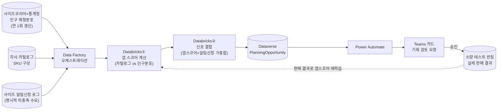

> 관련 문서: [[01. 모두의창업 2기 지원 준비]] · [[02. 확장 로드맵 (ESG_DPP)]]
> **용도**: 모두의창업 지원서 로드맵의 Year 2 상세. Year 1(체형·날씨 조건화 예측)을 새 영역으로 넓히는 대신 **같은 축(체형 수요)을 더 깊이 파는 방향**으로 선택 — K3의 소싱/CSR 트래킹 기능도 검토했으나, 데이터 예측보다 수기 관리형 기능이라 우리 정체성(Databricks 기반 예측)과 결이 안 맞아 보류.
> 작성일: 2026-09-04

## 포지셔닝
Year 1이 "체형분포로 조건화된 예측"이라는 축을 처음 만든 거라면, Year 2는 **같은 축을 네 방향으로 심화**한다 — 새 기술 도입이 아니라 기존 파이프라인의 정밀도·검증·활용 범위·적용 시점을 넓히는 것.

## ① 동적 사이즈 커브 — K3 "Ratio Curves"의 데이터 기반 업그레이드
**K3 대비**: K3의 Ratio Curves는 "과거 판매 비율을 고정 템플릿(S:M:L:XL=10:30:40:20 등)으로 반복 적용"하는 정적 규칙. 매장이 바뀌어도 같은 비율을 씀.
**우리 방향**: Year 1은 **전국 평균** 체형분포(사이즈코리아)로 예측하는데, Year 2는 **매장/채널/지역별로 세분화된 체형분포**까지 반영해 사이즈 커브를 동적으로 재계산.
**구현**: 완전히 새로운 기술 아님 — 기존 Databricks 파이프라인에 "지역 가중치" 피처를 추가하는 확장. risk_score 공식의 "인기도가중치" 항과 같은 방식으로 "지역가중치" 항 추가.
**한 줄 근거**: "K3는 매장이 바뀌어도 같은 비율, 우리는 매장마다 다른 예측."
**데이터 출처**(2026-09-04 확인): 새로 수집하지 않고 **공개 통계 2개를 결합**해서 추정.
- 사이즈코리아: 연령·성별별 체형 분포 (이미 Year 1에서 사용 중). 사이즈코리아 자체도 수도권(서울)·경상권(대구) 등 지역 거점으로 나눠 측정하고 있어 지역성 반영 여지가 있음
- 통계청 인구총조사: 지역별 연령·성별 인구 구성(공개 데이터)
- 결합 방식: "이 지역은 20대 여성 비중이 높다"(통계청) × "20대 여성 평균 체형은 이렇다"(사이즈코리아) = 지역별 예상 체형분포 추정. `generate_v4.py` 확장으로 시뮬레이션 — Year 1과 같은 패턴(공개데이터 조건화) 반복이라 실행 가능성 높음
- (실제 서비스 확장 시) 가장 강력한 소스는 **자사 사이즈별 판매 실적의 지역 집계** — 별도 체형 데이터 없이도 그 자체가 대리지표가 됨

## ② 반품 피드백 루프 — 상시 자가검증
**배경**: Year 1은 9월 held-out 데이터와 1회성으로 대조 검증. 실제 서비스라면 이걸 계속 반복해야 함.
**우리 방향**: 이미 있는 반품 사유 데이터(사이즈 불만족 — R01 등 RMA 프로세스 코드)를 예측 정확도 검증 신호로 활용. "예측 → 실제 판매 → 사이즈 불만족 반품 발생 → 그 데이터로 재학습"이라는 닫힌 루프 상시 운영.
**구현**: 새 데이터 소스 필요 없음 — `33. Returns & RMA Process`에 이미 있는 반품 사유 데이터 재활용.
**의미**: Year 1의 "held-out 검증"이 발표용 1회 이벤트였다면, Year 2는 이걸 **운영 중에도 계속 스스로 확인하는 상시 메커니즘**으로 만드는 것 — "만들고 끝"이 아니라 "계속 더 정확해지는 시스템"이라는 서사.

## ③ 신규 체형 세그먼트 확장 시뮬레이션
**배경**: NQNQ는 "다양한 체형을 커버한다"는 브랜드 컨셉인데, 지금까지는 이걸 재고관리에만 썼음.
**우리 방향**: 지금 커버 안 하는 체형군(예: 플러스사이즈)으로 확장하면 수요가 어느 정도일지 시뮬레이션 — 기존 체형분포 조건화 모델에 새로운 인구통계 입력값을 넣어서 가상 수요를 추정.
**의미**: "재고관리 도구"에서 "**어떤 체형 세그먼트로 사업을 넓힐지 의사결정을 지원하는 도구**"로 격상 — 운영 효율 도구를 넘어 성장 전략 도구가 됨. NQNQ의 브랜드 정체성(체형 다양성)과 제품 로드맵이 직접 연결되는 지점이라 지원서 서사로도 좋음.

## ④ 체형 기반 상품기획 지원 툴 (2026-09-04 추가, ⚠️ 팀 논의 필요 — 나경 단독 구상)
**배경**: ①②③이 "이미 있는 상품을 얼마나/어디에 배분할지"였다면, 이건 한 단계 앞 — **"애초에 뭘 기획해야 하는지"**를 데이터로 보조.

**⚠️ 알려진 한계 (콜드스타트 문제)**: "카탈로그를 자사 판매 데이터 기준으로 분석해서 갭을 찾는다"는 최초 설계는 틀렸음 — **애초에 안 만든 사이즈는 판매 데이터 자체가 없어서 관측 자체가 불가능**. 아래 파이프라인은 이 문제를 피하도록 데이터 소스를 자사 판매 이력이 아니라 **외부 신호(인구통계·명시적 요청·소량 테스트) 중심**으로 다시 설계한 것.

### 파이프라인 (Year 1과 동일한 구조 재사용)

**단계별 설명**:
1. **입력 3종**: 인구 체형분포(외부, 판매이력 무관) + 자사 카탈로그 구성 + 사이즈 알림신청 로그(명시적 미충족 신호) — 셋 다 "안 팔아본 것"이어도 존재하는 데이터
2. **Databricks①**: 카탈로그 구성비 vs 인구분포 비교 → 체형별 "갭 스코어" (risk_score와 같은 패턴)
3. **Databricks②**: 갭 스코어에 알림신청 건수를 가중치로 결합 → "기획 우선순위 스코어" — 추정치(①)와 실제 신호(알림신청)를 합쳐서 신뢰도를 높임
4. **Dataverse 적재 → Teams 승인**: Year 1과 동일한 승인 패턴 그대로 재사용 — MD가 카드에서 "소량 테스트 런칭" 승인
5. **피드백 루프**: 테스트 런칭 실제 판매 결과가 다시 Databricks①로 들어가 갭 스코어를 재학습 — ②번(반품 피드백 루프)과 같은 원리를 여기서도 재사용

**중요한 경계선**: 이건 **데이터 인사이트 툴이지 AI가 디자인·카피를 만들어주는 게 아님** — 이미 스코프에서 제외 확정한 "GenAI 콘텐츠 생성(카피라이팅·룩북 이미지)"과는 명확히 다른 영역. [[21. Appservice Core model]] 7절의 원칙과 동일하게, **최종 기획 결정은 MD·디자이너가 하고 툴은 근거 데이터만 제공**(Human-in-the-loop 유지)

**Year1 연결**: 파이프라인 구조(Data Factory→Databricks→Dataverse→Power Automate→Teams) 자체를 그대로 재사용 — 새 아키텍처가 아니라 같은 틀에 새 데이터·새 스코어만 얹은 것

## 왜 K3 소싱/CSR 대신 이 방향인가
소싱 성과 추적·CSR 인증 모니터링은 실제로 "데이터가 중요한 업무"라기보다 **사람이 입력·확인하는 트래킹 성격**이 강함 — 우리가 내세우는 차별점(Databricks 기반 예측 모델)과 기술적 결이 다름. 대신 ①②③은 전부 **Year 1 파이프라인의 자연스러운 심화**라서, "완전히 다른 기능을 새로 추가한다"가 아니라 "이미 만든 걸 더 정교하게 만든다"는 로드맵 논리가 유지됨.

## 지원서에서 쓸 때
Year 3(ESG/DPP)가 "완전히 새 규제 대응 영역으로 확장"이라면, Year 2는 "기존 강점을 더 깊게"라는 대비가 명확해서, 로드맵 전체가 **"핵심 강화(Year 2) → 신규 영역 확장(Year 3)"**이라는 자연스러운 순서로 읽힘.
